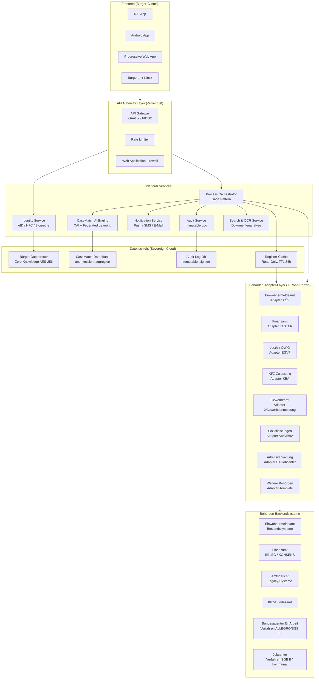
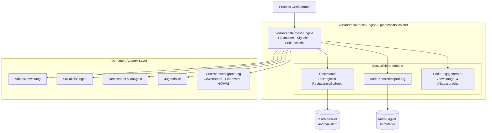
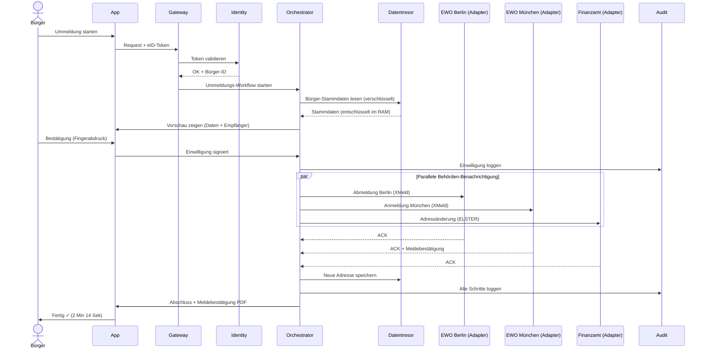
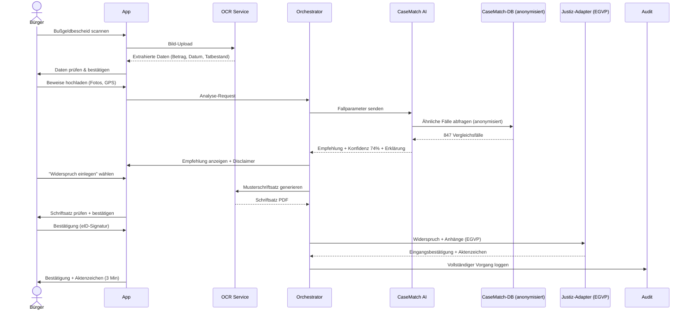
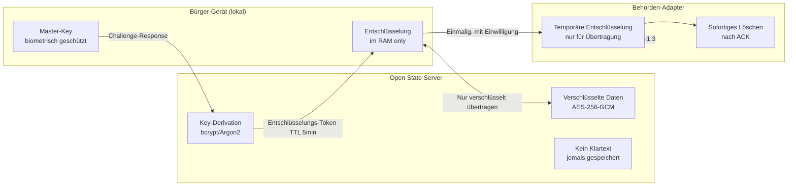
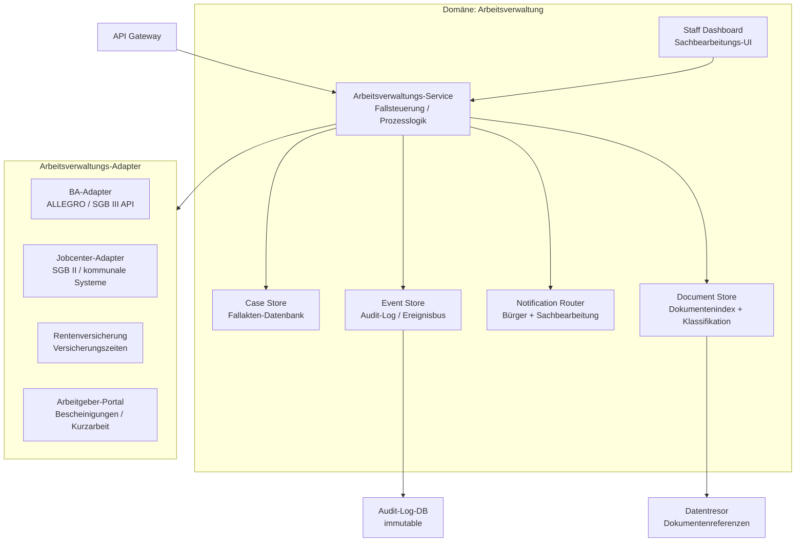

# Open State – Systemarchitektur

*Basis: docs/01–04*

---

## 1. Architektur-Übersicht

Open State folgt einer **dezentralen Microservices-Architektur** mit drei logischen Schichten:

1. **Frontend-Schicht** – Bürger-Clients (iOS, Android, PWA)
2. **Platform-Schicht** – API Gateway, Identity, Orchestrator, KI
3. **Backend-Schicht** – Behörden-Adapter, Datentresor, Audit

---

## 2. Mermaid-Gesamtdiagramm



---

## 2a. Verfahrensfairness Engine – Querschnittsschicht

Die Verfahrensfairness Engine ist keine eigenständige Domäne, sondern eine domänenübergreifende Querschnittskomponente. Sie ist zwischen dem Process Orchestrator und den Domänenadaptern angesiedelt und empfängt strukturierte Ereignisse aus allen Domänen.



### Architektonische Prinzipien der Querschnittsschicht

Alle Domänen teilen dieselben Grundprinzipien:

| Prinzip | Umsetzung |
|---------|-----------|
| **Fallakte** | Jede Domäne führt eine strukturierte Akte mit Audit-Log |
| **Statusmodell** | Zustandsbasierte Verfahrensführung mit definierten Übergangsbedingungen |
| **Audit-Log** | Unveränderlich, kryptografisch gesichert, domänenübergreifend konsistent |
| **Erklärschicht** | Verwaltungssprache für Sachbearbeitende, Alltagssprache für Bürger |
| **Keine Letztentscheidung** | Engine-Ausgaben sind Informationen, keine Verwaltungsentscheidungen |
| **Anfechtbarkeit** | Alle Engine-Markierungen können kommentiert oder übersteuert werden |

### CaseMatch als spezialisiertes Modul

CaseMatch ist ein Analyse-Modul innerhalb der Verfahrensfairness Engine, nicht eine eigenständige KI-Entscheidungsinstanz. Es liefert Fallvergleichsanalysen für die Domäne Rechtsstreit und Bußgeld und nutzt dieselben Grundprinzipien (Erklärbarkeit, Anfechtbarkeit, keine Letztentscheidung) wie die übergeordnete Engine.

### Unternehmensgründung als neue Domäne im Adapter-Layer

Die Domäne Unternehmensgründung ist im Adapter-Layer angebunden. Sie nutzt:
- XGewerbeanmeldung-Standard (XÖV) für Gewerbeamtsanbindung
- ELSTER-Protokoll für Finanzamtsanbindung
- Direkte IHK/HWK-Schnittstellen (in Entwicklung)
- Sozialversicherungs-Meldeschnittstellen

Technische Details zur Domäne: [docs/domains/unternehmensgruendung/](../docs/domains/unternehmensgruendung/README.md)

---

## 3. Tech-Stack

### 3.1 Frontend

| Schicht | Technologie | Begründung |
|---------|-------------|------------|
| iOS App | Swift / SwiftUI | Native Performance, Face ID / Touch ID, NFC |
| Android App | Kotlin / Jetpack Compose | Native Performance, NFC, Biometrie |
| PWA | React 18 + TypeScript | Plattformunabhängig, Offline-First (Service Worker) |
| Kiosk | React (Electron-basiert) | Einheitliche Codebasis mit PWA |
| State Management | Zustand + React Query | Leichtgewichtig, Server-State-Synchronisation |
| Design System | Open State Design System (Figma → Tokens) | Konsistenz über alle Plattformen |
| Accessibility | WCAG 2.1 AA, react-aria | Gesetzliche Pflicht, Inklusion |
| Offline-Fähigkeit | IndexedDB + Service Worker | Auch bei schlechter Verbindung nutzbar |

### 3.2 API Gateway & Sicherheit

| Komponente | Technologie | Begründung |
|------------|-------------|------------|
| API Gateway | Kong Enterprise | Bewährt, Plugin-Ökosystem, rate limiting |
| Authentifizierung | Keycloak + eIDAS eID-Server | EUDIW-kompatibel, FIDO2/WebAuthn |
| Zero-Trust | SPIFFE/SPIRE | Service-to-Service-Identitäten |
| WAF | ModSecurity + OWASP Ruleset | KRITIS-Anforderung |
| TLS | TLS 1.3 only, HSTS | BSI-Empfehlung |
| Secrets Management | HashiCorp Vault | Zertifikate, API-Keys zentral verwaltet |
| DDoS-Schutz | Cloudflare (EU-Instanz) | Kapazität, DSGVO-konform |

### 3.3 Platform Services (Backend)

| Service | Technologie | Skalierung |
|---------|-------------|------------|
| Process Orchestrator | Go 1.22 + Temporal.io (Workflow Engine) | Horizontal, Kubernetes |
| Identity Service | Rust (Actix-Web) | Sicherheitskritisch → Rust |
| CaseMatch AI | Python 3.12, FastAPI, PyTorch 2.x | GPU-Cluster, auto-scaling |
| Notification Service | Node.js + Bull Queue | Redis-backed, async |
| Audit Service | Go + Apache Kafka | Append-only Event Streaming |
| OCR / Dokumenten-Analyse | Python + Tesseract 5 + LLM-Wrapper | Async Processing |
| Search | Elasticsearch 8 (BSI-BSI-konform) | Cluster |

### 3.4 Behörden-Adapter-Layer

| Adapter | Protokoll | Standard |
|---------|-----------|---------|
| Einwohnermeldeamt | REST/SOAP | XMeld (XÖV) |
| Finanzamt | ELSTER-Schnittstelle | ELSTER XML |
| Justiz / Gerichte | EGVP | XJustiz |
| KFZ-Zulassung | REST | i-Kfz Portal API |
| Gewerbeamt | REST | XGewerbeanmeldung |
| Sozialleistungen | REST | XSoziales |
| Legacy-Adapter | SOAP/XML-Wrapper | Individuell |

**Adapter-Pattern:** Jeder Adapter implementiert ein einheitliches `BehördenAdapter`-Interface:
```go
type BehördenAdapter interface {
    SendRequest(ctx context.Context, req AdminRequest) (*AdminResponse, error)
    GetStatus(ctx context.Context, id string) (*StatusResponse, error)
    ValidateData(data map[string]interface{}) error
    GetCapabilities() AdapterCapabilities
}
```

### 3.5 Datenschicht

| Komponente | Technologie | Besonderheit |
|------------|-------------|--------------|
| Bürger-Datentresor | PostgreSQL 16 + pgcrypto | AES-256, Bürger-Key, Zero-Knowledge |
| Register-Cache | Redis 7 (Cluster) | Read-Only, TTL 24h, kein Schreiben |
| CaseMatch-DB | PostgreSQL + TimescaleDB | Nur anonymisierte Aggregatdaten |
| Audit-Log | Apache Kafka + ClickHouse | Immutable, kryptografisch signiert |
| Dokumente / Anhänge | MinIO (S3-kompatibel, on-prem) | DSGVO, kein US-Cloud-Provider |
| Backup | Tägliches Snapshot + Point-in-Time | RPO: 1h, RTO: 4h |

### 3.6 Infrastruktur & Betrieb

| Aspekt | Technologie |
|--------|-------------|
| Container | Docker + Kubernetes (K8s 1.30) |
| Service Mesh | Istio (mTLS zwischen allen Services) |
| CI/CD | GitLab CI (on-prem, BSI-konform) |
| Monitoring | Prometheus + Grafana |
| Logging | ELK-Stack (Elasticsearch, Logstash, Kibana) |
| Tracing | Jaeger (OpenTelemetry) |
| Infrastructure as Code | Terraform + Ansible |
| Cloud | GAIA-X / Hessische Staatswolke + Backup DE-CIX |
| Disaster Recovery | Geo-redundant: 2 Rechenzentren (Frankfurt + Berlin) |
| BSI-Zertifizierung | ISO 27001 + BSI IT-Grundschutz (verpflichtend) |

---

## 4. Datenfluss-Diagramme

### 4.1 Datenfluss: Wohnsitzummeldung



### 4.2 Datenfluss: CaseMatch AI (Bußgeld-Widerspruch)



### 4.3 Zero-Knowledge-Datentresor-Architektur



---

## 5. Sicherheitsarchitektur

### 5.1 Bedrohungsmodell (STRIDE)

| Bedrohung | Maßnahme |
|-----------|----------|
| **S**poofing (Identitätsfälschung) | eID NFC + FIDO2, keine Passwörter |
| **T**ampering (Datenmanipulation) | Signierte Audit-Logs, HMAC auf alle API-Responses |
| **R**epudiation (Abstreitbarkeit) | Kryptografisch signierte Einwilligungen, unveränderliches Log |
| **I**nformation Disclosure (Datenleck) | Zero-Knowledge-Tresor, Datensparsamkeit, Need-to-Know |
| **D**enial of Service | WAF, Rate Limiting, DDoS-Schutz, Auto-Scaling |
| **E**levation of Privilege (Rechteausweitung) | Least-Privilege-Prinzip, RBAC, Zero-Trust zwischen Services |

### 5.2 Penetrationstests & Audits

- **Quartalsweise:** Automatisierte Vulnerability-Scans (OWASP ZAP, Trivy)
- **Halbjährlich:** Manueller Penetrationstest durch BSI-akkreditiertes Unternehmen
- **Jährlich:** Vollständiges Sicherheitsaudit + Code-Audit (Open Source Community eingeladen)
- **Kontinuierlich:** Bug-Bounty-Programm (öffentlich, Auszahlung ab 500 €)

---

## 6. Skalierbarkeit & Performance-Ziele

| Metrik | Ziel | Notfall-Maximum |
|--------|------|-----------------|
| Gleichzeitige Nutzer | 2 Mio. | 10 Mio. (Steuersaison) |
| API-Latenz (p99) | < 200 ms | < 500 ms |
| Systemverfügbarkeit | 99,9 % (8,7h Downtime/Jahr) | — |
| Prozesszeit Ummeldung | < 3 Min (End-to-End) | — |
| Backup RPO | 1 Stunde | — |
| Backup RTO | 4 Stunden | — |
| Datenbankgröße (Vollbetrieb) | ~50 TB | 200 TB |
| CDN-Cache-Hit-Rate | > 80 % | — |

**Skalierungsstrategie:**
- Kubernetes HPA (Horizontal Pod Autoscaler) für alle Services
- Datenbankreplikation: PostgreSQL Patroni-Cluster (1 Primary + 2 Replicas pro Region)
- Stateless Services: Alle Platform-Services sind zustandslos → beliebig horizontal skalierbar
- Read-Replicas für Register-Cache → Lesevorgänge entlasten Behörden-Adapter

---

## 7. Interoperabilität & Standards

| Standard | Anwendung |
|----------|-----------|
| XÖV (XML-basierte Standards) | Datenaustausch mit allen deutschen Behörden |
| eIDAS 2.0 / EUDIW | Digitale Identität, EU-Kompatibilität (Rollout läuft) |
| FIDO2 / WebAuthn | Passwortlose Authentifizierung |
| OpenAPI 3.1 | Alle öffentlichen APIs vollständig dokumentiert |
| OAuth 2.1 + PKCE | Autorisierung |
| OpenID Connect 1.0 | Föderierte Identität |
| ELSTER-XML | Steuerliche Datenkommunikation |
| EGVP / XJustiz | Elektronischer Rechtsverkehr |
| GAIA-X Compliance | Cloud-Infrastruktur |
| BSI IT-Grundschutz | Sicherheitszertifizierung |
| ISO 27001 | Informationssicherheits-Managementsystem |

---

## 8. Deployment-Strategie

### Blue-Green-Deployment
- Zwei identische Produktionsumgebungen (Blue + Green)
- Neues Release auf Green ausrollen, Traffic schrittweise umlenken
- Sofortiger Rollback möglich (< 5 Min)

### Feature Flags
- Neue Module per Feature Flag aktivierbar (pro Region, pro Nutzergruppe)
- Pilotkommune erhält zuerst neue Features → Feedback vor bundesweitem Rollout

### Datenbankmigrationen
- Backward-kompatible Migrationen (niemals breaking changes ohne Migrationspfad)
- Expand-Contract-Pattern für alle Schema-Änderungen

---

## 9. Domänen-Architektur: Arbeitsverwaltung

Die Domäne Arbeitsverwaltung fügt sich als eigenständige, abgegrenzte Fachdomäne in die bestehende Architektur ein. Sie nutzt den gemeinsamen Platform-Stack und ergänzt ihn um domänenspezifische Komponenten.



### 9.1 Domänen-Komponenten

| Komponente | Verantwortlichkeit |
|------------|-------------------|
| Arbeitsverwaltungs-Service | Fallsteuerung, Statustransitionen, Prozesslogik |
| Case Store | Persistente Fallakten-Datenbank (PostgreSQL, verschlüsselt) |
| Event Store | Unveränderliches Ereignisprotokoll (Apache Kafka + Audit-Persistence) |
| Notification Router | Weiterleitung an Notification Service (Push, SMS, E-Mail) |
| Document Store | Dokumentenindex, Klassifikation (OCR-gestützt), Verknüpfung mit Datentresor |
| Staff Dashboard | Fachspezifische UI für Sachbearbeitung (React / separate Deployment-Einheit) |

### 9.2 Schnittstellen nach außen

| Schnittstelle | Richtung | Protokoll | Standard |
|---------------|----------|-----------|---------|
| BA ALLEGRO | Open State → BA | REST (geplant) / SOAP (Legacy) | XSoziales / BA-intern |
| Jobcenter-Systeme | Open State ↔ Jobcenter | REST | XSoziales (föderale Abstimmung nötig) |
| Rentenversicherung | Open State ← RV | REST | XRentenversicherung |
| Arbeitgeber-Portal | Arbeitgeber → Open State | REST | XArbeitgeberbescheinigung |
| ELSTER (Einkommensdaten) | Open State ← Finanzamt | ELSTER API | Bestehend |
| Einwohnermeldeamt (Adressdaten) | Open State ← EWO | XMeld | Bestehend (Once-Only) |

### 9.3 Rollenbasierte Zugriffssteuerung (Arbeitsverwaltung)

```
OAuth2 Scopes – Arbeitsverwaltung:

citizen:av:read          → Fallstatus, Dokumente, Kommunikation (eigene)
citizen:av:write         → Dokumente einreichen, Änderungen melden, Widerspruch
staff:av:read            → Vollständige Fallakte (zugewiesene Fälle)
staff:av:write           → Rückfragen, Entscheidungen, Statusänderungen
staff:av:transfer        → Fallübertragung
management:av:read       → Aggregierte Übersicht, Eskalationen
partner:av:read          → Eingeschränkt, nach Bürger-Einwilligung
employer:av:write        → Bescheinigungen einreichen
```

### 9.4 Besondere Anforderungen dieser Domäne

- **Datenschutz-Folgenabschätzung (DSFA)** zwingend vor Pilotierung (Art. 35 DSGVO)
- **Audit-Log** jedes Zugriffs auf Sozialdaten (§ 67a SGB X)
- **Keine automatisierten Verwaltungsakte** – jede Entscheidung durch menschliche Sachbearbeitung bestätigt
- **Besondere Datenkategorien** (Gesundheitsdaten bei Reha/SB-Ausweis) in separater Speicherzone
- **Föderale Abstimmung** für Jobcenter-Adapter (gemeinsame Trägerschaft)

---

*Erstellt auf Basis: docs/01_Master_Blueprint.md, docs/02_Vergleich_Best_Practices.md, legal/03_Rechtliche_Machbarkeitsstudie.md, transparency/04_Transparenz_Haftung.md*
*Erweitert um Domäne Arbeitsverwaltung: docs/domains/arbeitsverwaltung/*
