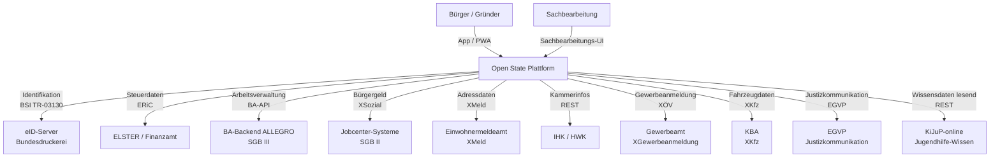

# arc42 – Kapitel 3: Kontextabgrenzung

---

## 3.1 Was liegt innerhalb von Open State?

Open State ist die zentrale Verwaltungsplattform, die folgende Funktionsbereiche verantwortet:

**Bürgerinteraktion:**
- Fallanlage, Statusverfolgung, Dokumenteneinreichung, Rückfragenbeantwortung, Bescheideinsicht, Terminverwaltung, Widerspruchsinitiierung
- Verfahrenshistorie und Timeline-Einsicht
- Datentresor-Verwaltung (eigene Daten einsehen, löschen, Weitergabe protokolliert)

**Sachbearbeitung:**
- Fallsicht für Sachbearbeitende (rollensensitiv)
- Hinweise der Verfahrensfairness Engine
- Kommunikationshistorie mit Bürgern
- Bescheid-Erstellung mit Erklärschicht

**Systemquerschnitt:**
- Fallakte als zentrales Datenmuster aller Domänen
- Statusmodell mit definierten Zuständen und Übergangen
- Audit-Log (unveränderlich, kryptografisch gesichert)
- Erklärschicht (Mapping Verwaltungssprache → Alltagssprache)
- Verfahrensfairness Engine (Konsistenzprüfung, Begründungsqualität, Signale)
- Identitätsdienst (eID-Integration, Zero-Knowledge-Datentresor)
- Benachrichtigungsdienst (Push, E-Mail, SMS)

**Behördenanbindung:**
- Behörden-Adapter-Layer mit XÖV-Adaptern für alle relevanten externen Systeme
- Zuständigkeitsermittlung zwischen Bundesagentur und Jobcenter

---

## 3.2 Was liegt außerhalb von Open State?

Open State ist kein Ersatz für die Fachsysteme der Behörden. Die folgenden Systeme liegen außerhalb und werden über definierte Schnittstellen angebunden:

- Bestandssysteme der Bundesagentur für Arbeit (ALLEGRO, VERBIS)
- Bestandssysteme der Jobcenter (kommunale Systeme)
- Finanzamtssysteme (ELSTER-Backend)
- Einwohnermeldeamt-Bestandssysteme
- Justizsysteme
- KFZ-Bundesamt-Backend
- IHK/HWK-Systeme
- KiJuP-online (externer Wissenspool für Jugendhilfe, nur lesend)
- eID-Server der Bundesdruckerei

Die fachliche Bearbeitung von Verwaltungsvorgängen (Prüfung, Entscheidung, Bescheiderstellung) liegt bei den Behörden und ihren Sachbearbeitenden. Open State stellt die Infrastruktur für Eingang, Kommunikation, Dokumentation und Transparenz – nicht für die Entscheidung selbst.

---

## 3.3 Externe Systeme und Schnittstellen

| System | Art der Interaktion | Protokoll / Standard | Richtung |
|--------|--------------------|--------------------|----------|
| **eID-Server (Bundesdruckerei)** | Identitätsverifizierung bei Fallanlage und sicherheitsrelevanten Aktionen | BSI TR-03130, AusweisApp2-SDK | → eID-Server |
| **ELSTER (Finanzbehörden)** | Steuerdaten für AutoFill-Steuererklärung | ERiC-Schnittstelle | ↔ ELSTER |
| **BA-ALLEGRO** | Arbeitsverwaltungsdaten (Fallstand, Ansprüche, SGB III) | SOAP/REST (BA-API) | ↔ BA |
| **Jobcenter-Systeme** | SGB II Leistungsdaten | XSozial | ↔ Jobcenter |
| **Einwohnermeldeamt** | Adressdaten, Wohnsitzverifikation | XMeld | → EWO |
| **KBA (Kraftfahrtbundesamt)** | Fahrzeugdaten | OSCI/XKfz | → KBA |
| **EGVP** | Justizkommunikation, Widerspruchseingang bei Gerichten | EGVP-Standard | ↔ Gericht |
| **IHK / HWK** | Gewerbliche Qualifikationsnachweise, Kammermitgliedschaft | REST (in Entwicklung) | → IHK/HWK |
| **Gewerbeamt** | Gewerbeanmeldung, -abmeldung, -ummeldung | XGewerbeanmeldung (XÖV) | → Gewerbeamt |
| **KiJuP-online** | Jugendhilfe-Wissenspool (nur lesend, keine Personaldaten) | REST | → KiJuP |

---

## 3.4 Kontextdiagramm

---

## 3.5 Abgrenzungsprinzipien

**Was Open State verantwortet:**
- Vollständige Dokumentation aller Interaktionen zwischen Bürger und Staat
- Statusverfolgung und Zustandskommunikation
- Transparenz über Entscheidungsgrundlagen
- Sichere, unveränderliche Protokollierung
- Verständlichkeit von Bescheiden und Rückfragen

**Was Open State nicht verantwortet:**
- Die inhaltliche Richtigkeit von Verwaltungsentscheidungen
- Die fachliche Bearbeitung von Anträgen (das liegt bei den Sachbearbeitenden)
- Den Inhalt der Bestandssysteme der angebundenen Behörden
- Die Rechtmäßigkeit der Entscheidungen der angebundenen Behörden

Diese Abgrenzung ist nicht nur organisatorisch relevant, sondern auch haftungsrechtlich. Open State ist Infrastruktur – die Entscheidungsverantwortung verbleibt bei den jeweils zuständigen Behörden.

---

*Verweis: [architecture/05_Systemarchitektur.md](../05_Systemarchitektur.md) – Detaildiagramm mit allen Adaptern*
*Verweis: [docs/11_Entwickler_Handover.md](../../docs/11_Entwickler_Handover.md) – Behörden-Adapter Implementierungsleitfaden*
