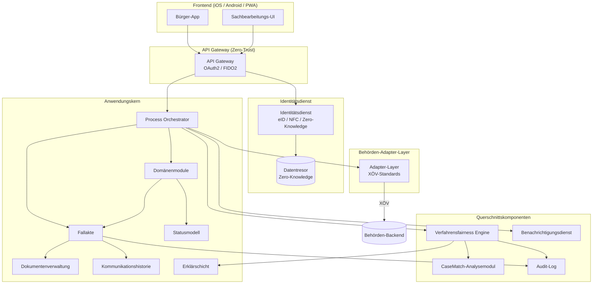

# arc42 – Kapitel 5: Bausteinsicht

---

Die Bausteinsicht beschreibt die strukturellen Komponenten von Open State: Was tut jede Komponente? Wofür ist sie verantwortlich? Welche Story legitimiert sie? Was sind ihre Inputs und Outputs? Wovon hängt sie ab?

---

## 5.1 Übersicht: Bausteine und ihre Beziehungen

---

## 5.2 Bausteine im Detail

### 5.2.1 Domänenmodule

| Attribut | Beschreibung |
|----------|-------------|
| **Name** | Domänenmodule (Arbeitsverwaltung, Unternehmensgründung, Jugendhilfe, Sozialleistungen, Wohnsitz, Rechtsstreit) |
| **Verantwortung** | Fachliche Logik je Domäne: Zuständigkeitsermittlung, Verfahrensregeln, domänenspezifische Statuszustände, Pflichtfelder, Fristen |
| **Story-Bezug** | US-AV-001 bis US-AV-007 (Arbeitsverwaltung); weitere Domänen folgen demselben Muster |
| **Inputs** | Bürgeranfragen (über API Gateway), Ereignisse aus Behörden-Adapter-Layer, Verfahrensfairness Engine Signale |
| **Outputs** | Fallanlage, Statusübergänge, Dokumentenanforderungen, Rückfragen, Bescheidinitiierung |
| **Abhängigkeiten** | Fallakte, Statusmodell, Behörden-Adapter-Layer, Benachrichtigungsdienst, Audit-Log |

Jedes Domänenmodul ist ein abgegrenzter Bounded Context mit eigener fachlicher Logik. Die Domänen teilen keine direkte Abhängigkeit untereinander – Querschnittsfunktionen laufen über gemeinsame Komponenten (Fallakte, Audit-Log, Verfahrensfairness Engine).

---

### 5.2.2 Fallakte

| Attribut | Beschreibung |
|----------|-------------|
| **Name** | Fallakte |
| **Verantwortung** | Zentrale Datenstruktur für jeden Verwaltungsvorgang: Fall-ID, Vorgangstyp, aktueller Status, Dokumentenliste, Kommunikationshistorie, Fristen, Bearbeitungshistorie, Audit-Log-Verweis |
| **Story-Bezug** | US-AV-001 (Fallanlage), US-AV-002 (Status), US-AV-003 (Dokumente), US-AV-007 (Historie) |
| **Inputs** | Fallanlage-Daten (Bürger), Sachbearbeitungs-Aktionen, Behördenrückmeldungen, Verfahrensfairness Engine Markierungen |
| **Outputs** | Aktuelle Fallansicht (Bürger, Sachbearbeitung), Statusänderungen, Audit-Events |
| **Abhängigkeiten** | Statusmodell, Dokumentenverwaltung, Kommunikationshistorie, Audit-Log |

Die Fallakte enthält keine personenbezogenen Klardaten des Bürgers direkt – diese liegen im Datentresor. Die Fallakte hält nur einen Verweis (Referenz) auf den Datentresor-Eintrag.

---

### 5.2.3 Statusmodell

| Attribut | Beschreibung |
|----------|-------------|
| **Name** | Statusmodell |
| **Verantwortung** | Zustandsmaschine für alle Verfahren: definierte Zustände, erlaubte Übergänge, Bedingungen für Übergänge, Zeitstempel-Protokollierung |
| **Story-Bezug** | US-AV-002 (Status einsehen), US-AV-001 (Status nach Fallanlage), US-AV-006 (Zustellung Bescheid) |
| **Inputs** | Aktionen von Sachbearbeitung, Bürger, Behörden-Adapter-Layer; Trigger aus Verfahrensfairness Engine |
| **Outputs** | Neuer Zustand, Übergangs-Zeitstempel, Audit-Event, Benachrichtigungs-Trigger |
| **Abhängigkeiten** | Fallakte, Audit-Log, Benachrichtigungsdienst |

Das Statusmodell ist domänenübergreifend als Muster implementiert – jede Domäne definiert ihre eigenen Zustände und Übergänge, aber alle nutzen dieselbe Zustandsmaschinen-Infrastruktur.

---

### 5.2.4 Dokumentenverwaltung

| Attribut | Beschreibung |
|----------|-------------|
| **Name** | Dokumentenverwaltung |
| **Verantwortung** | Sicherer Upload von Dokumenten, Statuszuordnung (ausstehend / eingegangen / geprüft / abgelehnt), Verknüpfung mit Fallakte, Metadaten-Verwaltung, OCR-Integration |
| **Story-Bezug** | US-AV-003 (Unterlagen nachreichen) |
| **Inputs** | Dokument-Upload (Bürger), Statusänderungen (Sachbearbeitung), OCR-Ergebnisse |
| **Outputs** | Dokument-ID, Upload-Zeitstempel, Dokumentenstatus, Audit-Event, Benachrichtigung an Sachbearbeitung |
| **Abhängigkeiten** | Fallakte, Audit-Log, OCR-Service, Benachrichtigungsdienst, Dokumentenspeicher |

---

### 5.2.5 Kommunikationshistorie

| Attribut | Beschreibung |
|----------|-------------|
| **Name** | Kommunikationshistorie |
| **Verantwortung** | Vollständige, chronologische Dokumentation aller Kommunikationsereignisse: Rückfragen, Bescheide, Nachrichten, Benachrichtigungen – kanalübergreifend |
| **Story-Bezug** | US-AV-004 (Rückfragen), US-AV-006 (Bescheid), US-AV-007 (Historie) |
| **Inputs** | Nachrichten von Sachbearbeitung und Bürger, Bescheide aus Behördensystemen, System-Benachrichtigungen |
| **Outputs** | Vollständige Timeline-Ansicht (Bürger), Kommunikationsübersicht (Sachbearbeitung), Audit-Events |
| **Abhängigkeiten** | Fallakte, Audit-Log, Erklärschicht (für Bescheide und Rückfragen), Benachrichtigungsdienst |

---

### 5.2.6 Audit-Log

| Attribut | Beschreibung |
|----------|-------------|
| **Name** | Audit-Log |
| **Verantwortung** | Unveränderliche, kryptografisch gesicherte Protokollierung aller Ereignisse: Typ, Zeitstempel, Akteur, Zustand vor/nach, Referenz auf Fallakte |
| **Story-Bezug** | US-AV-007 (Historie nachvollziehen); alle Stories produzieren Audit-Events |
| **Inputs** | Ereignisse aus allen Systemkomponenten (Statusübergänge, Datenzugriffe, Fallanlage, Dokumenten-Upload, Bescheid-Zustellung) |
| **Outputs** | Audit-Trail (für Bürger: Timeline-Ansicht; für Aufsicht: vollständiges Log; für Export: PDF/JSON) |
| **Abhängigkeiten** | Kryptographie-Infrastruktur (Signierung), Audit-Log-DB (immutable) |

Das Audit-Log ist schreibgeschützt nach dem Append-Only-Prinzip. Keine Komponente darf Einträge ändern oder löschen.

---

### 5.2.7 Erklärschicht

| Attribut | Beschreibung |
|----------|-------------|
| **Name** | Erklärschicht |
| **Verantwortung** | Mapping von Verwaltungssprache auf Alltagssprache für Bescheide, Rückfragen, Statusmeldungen; Versionierung der Erklärungstexte; Trennung von juristischer und erklärender Schicht |
| **Story-Bezug** | US-AV-006 (Bescheid verstehen), US-AV-004 (Rückfrage verstehen) |
| **Inputs** | Juristische Bescheidtexte, Rückfragevorlagen, Statusbeschreibungen; ggf. KI-Assistenz-Ausgaben (mit menschlicher Prüfung) |
| **Outputs** | Zwei-Schichten-Darstellung (juristische Fassung + Erklärungsschicht), typisierte Erklärungsblöcke (Was wurde entschieden / Warum / Was bedeutet das / Was kann ich tun) |
| **Abhängigkeiten** | Kommunikationshistorie, Bescheid-Verwaltung, Redaktions-Workflow |

---

### 5.2.8 Verfahrensfairness Engine

| Attribut | Beschreibung |
|----------|-------------|
| **Name** | Verfahrensfairness Engine |
| **Verantwortung** | Domänenübergreifende Querschnittskomponente: Konsistenzprüfung ähnlicher Fälle, Prüfung auf vollständige Begründungen, Fristplausibilität, Dokumentationsvollständigkeit; Ausgabe von Hinweisen und Markierungen – keine Entscheidungen |
| **Story-Bezug** | Alle AV-Stories; domänenübergreifend |
| **Inputs** | Strukturierte Ereignisse aus allen Domänen (Statusübergänge, Bescheide, Fristen, Fallmuster) |
| **Outputs** | Qualitätssignale und Hinweise für Sachbearbeitende, Markierungen für Audit-Log, Informationen für Bürger |
| **Abhängigkeiten** | Audit-Log, CaseMatch-Analysemodul, Erklärschicht, alle Domänenmodule |

Die Verfahrensfairness Engine ist zwischen dem Process Orchestrator und den Domänenadaptern angesiedelt. Alle Ausgaben sind erklärbar, anfechtbar und ohne automatische Wirkung.

---

### 5.2.9 CaseMatch-Analysemodul

| Attribut | Beschreibung |
|----------|-------------|
| **Name** | CaseMatch-Analysemodul |
| **Verantwortung** | Fallvergleichsanalyse: ähnliche Fälle identifizieren, Inkonsistenzen in der Behandlung ähnlicher Fälle sichtbar machen, spezialisiert auf Rechtsstreit und Bußgeld |
| **Story-Bezug** | Domäne Rechtsstreit / Bußgeld; untergeordnet zu Verfahrensfairness Engine |
| **Inputs** | Anonymisierte Falldaten aus der CaseMatch-DB |
| **Outputs** | Fallvergleichs-Analysen, Inkonsistenz-Hinweise (an Verfahrensfairness Engine) |
| **Abhängigkeiten** | Verfahrensfairness Engine, CaseMatch-DB (anonymisiert, aggregiert) |

---

### 5.2.10 Identitätsdienst

| Attribut | Beschreibung |
|----------|-------------|
| **Name** | Identitätsdienst |
| **Verantwortung** | eID-Integration (BSI TR-03130, AusweisApp2-SDK), Token-Ausstellung (OAuth2/FIDO2), Zero-Knowledge-Datentresor-Verwaltung |
| **Story-Bezug** | US-AV-001 (eID-Pflicht bei Fallanlage), alle sicherheitsrelevanten Stories |
| **Inputs** | eID-Verifikationsanfragen, Authentifizierungsanfragen |
| **Outputs** | Verifizierte Identität, Auth-Token, Datentresor-Zugang |
| **Abhängigkeiten** | eID-Server (Bundesdruckerei), Datentresor-DB (Zero-Knowledge), API Gateway |

---

### 5.2.11 Behörden-Adapter-Layer

| Attribut | Beschreibung |
|----------|-------------|
| **Name** | Behörden-Adapter-Layer |
| **Verantwortung** | Anbindung aller externen Behördensysteme über XÖV-Standards; Protokolltransformation; Fehlerbehandlung bei Behörden-Ausfällen; Adapter-Template für neue Behörden |
| **Story-Bezug** | Alle Stories mit Behördeninteraktion (US-AV-001 Zuständigkeitsermittlung, US-AV-003 Dokumentenweiterleitung) |
| **Inputs** | Anfragen aus Domänenmodulen und Process Orchestrator |
| **Outputs** | Antworten von Behördensystemen, transformiert in interne Datenformate |
| **Abhängigkeiten** | XÖV-Standards (XMeld, XSozial, XGewerbeanmeldung, XKfz, EGVP), BA-API, ELSTER |

---

*Verweis: [architecture/05_Systemarchitektur.md](../05_Systemarchitektur.md) – Vollständiges Mermaid-Gesamtdiagramm*
*Verweis: [docs/engines/verfahrensfairness/](../../docs/engines/verfahrensfairness/README.md)*
