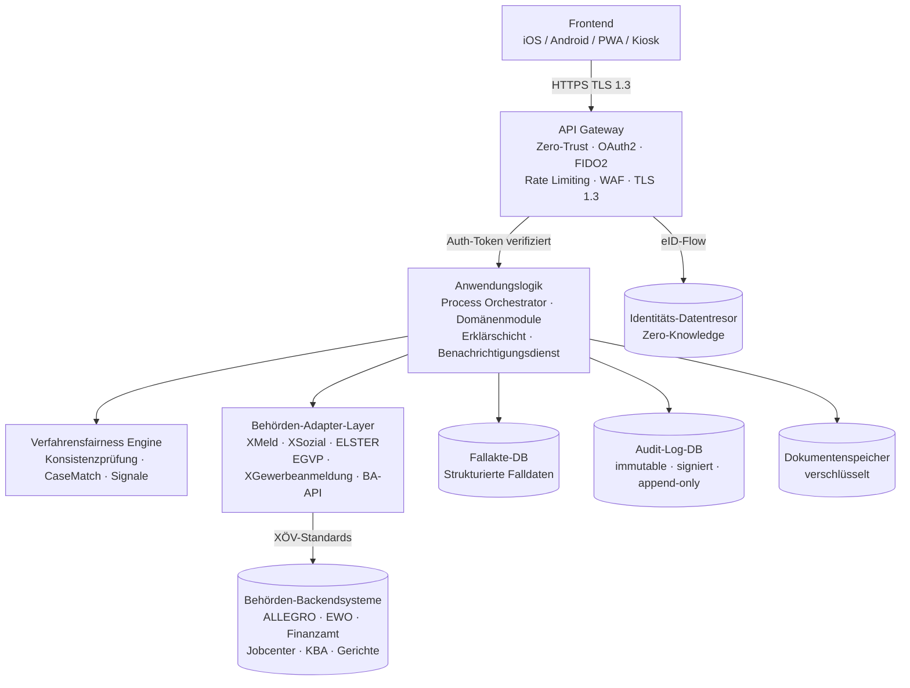

# arc42 – Kapitel 7: Verteilungssicht

---

**Wichtiger Hinweis:** Dieses Kapitel beschreibt eine konzeptionelle logische Verteilungssicht. Es trifft keine finale technische Festlegung auf spezifische Infrastrukturprodukte oder Cloud-Anbieter. Die konkrete Infrastrukturspezifikation liegt in `infrastructure/terraform/` (noch in Entwicklung).

---

## 7.1 Logische Schichten

Open State ist in fünf logische Schichten gegliedert, die jeweils unterschiedliche Verantwortlichkeiten und Sicherheitsanforderungen tragen:

### Schicht 1: Frontend (iOS / Android / PWA)

Native Apps für iOS (Swift/SwiftUI) und Android (Kotlin/Jetpack Compose) sowie eine Progressive Web App (React 18 + TypeScript) für alle Plattformen ohne App-Installation. Kiosk-Terminals in Bürgerzentren ergänzen den Zugang für Bürger ohne eigene Geräte.

Das Frontend enthält keine Geschäftslogik. Es ist reines UI – es zeigt Zustände und nimmt Eingaben entgegen. Alle Entscheidungslogik liegt im Anwendungskern.

### Schicht 2: API Gateway (Zero-Trust)

Alle Anfragen von Frontends laufen durch das API Gateway. Es verantwortet:
- Authentifizierung und Autorisierung (OAuth2/FIDO2)
- TLS 1.3-Terminierung
- Rate Limiting (Schutz vor Missbrauch)
- Web Application Firewall
- Routing zu den Anwendungsdiensten

Das Zero-Trust-Prinzip bedeutet: Kein Request wird ohne Verifikation als vertrauenswürdig eingestuft – auch nicht innerhalb des Systems.

### Schicht 3: Anwendungslogik

Enthält den Process Orchestrator, alle Domänenmodule, die Verfahrensfairness Engine und die Erklärschicht. Der Process Orchestrator koordiniert domänenübergreifende Abläufe nach dem Saga-Pattern: Jeder Workflow ist in atomare, rückrollbare Schritte zerlegt.

Die Anwendungslogik ist zustandslos – der Zustand liegt in der Datenhaltungsschicht.

### Schicht 4: Integrationsschicht (Behörden-Adapter-Layer)

Die Integrationsschicht übersetzt zwischen dem internen Datenmodell von Open State und den XÖV-Standards der angebundenen Behörden. Jeder Adapter ist technisch isoliert – ein Ausfall eines Adapters beeinflusst nicht die anderen.

### Schicht 5: Datenhaltung

Vier logisch getrennte Datenbereiche mit unterschiedlichen Sicherheits- und Zugriffsprofilen:

- **Fallakte-DB:** Strukturierte Falldaten, Statusmodell, Dokumentenmetadaten, Kommunikationshistorie
- **Audit-Log-DB (immutable):** Append-only, kryptografisch signiert, kein Schreibzugriff außer Append
- **Dokumentenspeicher:** Verschlüsselte Dokumente, referenziert aus der Fallakte
- **Identitäts- und Datentresor:** Zero-Knowledge-Architektur; die Plattform hat keinen Klartext-Zugang

---

## 7.2 Verteilungsdiagramm (logisch)

---

## 7.3 Sicherheitszonierung

Die fünf Schichten befinden sich in logisch getrennten Sicherheitszonen:

| Zone | Schicht(en) | Zugriff von außen |
|------|-------------|-------------------|
| Public Zone | Frontend | Öffentlich erreichbar |
| DMZ | API Gateway | Nur von Public Zone |
| Application Zone | Anwendungslogik, Adapter-Layer | Nur von DMZ |
| Data Zone | Fallakte-DB, Dokumentenspeicher | Nur von Application Zone |
| High-Security Zone | Audit-Log-DB, Datentresor | Nur von Application Zone, mit zusätzlicher Autorisierung |

---

## 7.4 Anforderungen an die Infrastruktur (konzeptionell)

- **Sovereign Cloud:** Alle Daten und Verarbeitungen unterliegen deutschem/europäischem Recht. Kein Hosting bei Anbietern außerhalb der EU ohne explizite Datenschutzfolgenabschätzung.
- **Hochverfügbarkeit:** Staatliche Infrastruktur erfordert definierte Ausfallzeiten-SLAs.
- **Disaster Recovery:** Regelmäßige Backups mit definierten Recovery-Zielen.
- **Infrastruktur als Code:** Terraform-basierte Infrastrukturspezifikation unter `infrastructure/terraform/`.

---

*Verweis: [architecture/05_Systemarchitektur.md](../05_Systemarchitektur.md) – Detailliertes Gesamtdiagramm mit Tech-Stack*
*Verweis: [docs/11_Entwickler_Handover.md](../../docs/11_Entwickler_Handover.md) – Deployment & CI/CD*
